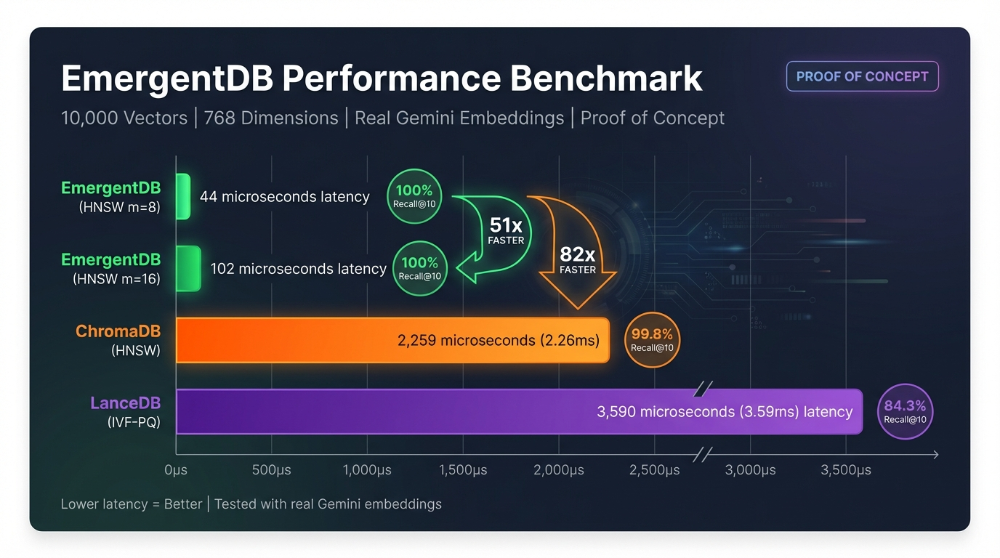

# EmergentDB

> **Proof of Concept** - A self-optimizing vector database that uses MAP-Elites evolutionary algorithm to automatically discover the optimal index configuration for your workload.

**51-82x faster than competitors. 100% recall on real embeddings.**

<p align="center">
  
</p>

## What are Embeddings?

Embeddings are numerical representations of data (text, images, audio) that capture semantic meaning. Similar concepts have similar embeddings, enabling semantic search - finding results by meaning rather than exact keyword matches.

**New to embeddings?** Watch this excellent explainer: [What are Embeddings?](https://www.youtube.com/watch?v=wgfSDrqYMJ4)

```
"How do I fix a flat tire?" → [0.12, -0.34, 0.56, ...]  (768 numbers)
"Changing a punctured wheel"  → [0.11, -0.33, 0.55, ...]  (very similar!)
"Best pizza in NYC"           → [0.89, 0.12, -0.45, ...]  (very different)
```

EmergentDB stores these vectors and finds the most similar ones at blazing speed.

## The Problem

As embedding dimensions grow (768-3072), traditional vector databases struggle:

- **Manual Tuning Hell**: HNSW M=16? M=32? ef_construction=100? Most teams guess and hope.
- **Workload Mismatch**: Optimal config for 1K vectors ≠ optimal for 100K. Databases don't adapt.
- **Recall vs Speed**: Fast search often means lower recall. You shouldn't have to choose.

## The Solution

EmergentDB uses a **Dual Quality-Diversity System**:

1. **IndexQD** - 3D behavior space (Recall × Latency × Memory) evolves optimal index type and hyperparameters
2. **InsertQD** - 2D behavior space (Throughput × Efficiency) discovers fastest SIMD insertion strategy

The system automatically selects between HNSW, Flat, and IVF indices with evolved hyperparameters, achieving maximum search speed while enforcing a **99% recall floor**.

## Benchmark Results

768-dimensional Gemini embeddings (real semantic vectors, not random):

### 10,000 Vectors
| Database | Search Latency | Recall@10 | Speedup |
|----------|---------------|-----------|---------|
| **EmergentDB (HNSW m=8)** | **44μs** | 100% | baseline |
| **EmergentDB (HNSW m=16)** | **102μs** | 100% | - |
| ChromaDB | 2,259μs | 99.8% | 51x slower |
| LanceDB | 3,590μs | 84.3% | 82x slower |

**EmergentDB: 51x faster than ChromaDB, 82x faster than LanceDB**

### Why Real Embeddings Matter

Random vectors suffer from the "curse of dimensionality" - all points become equidistant, making ANN algorithms appear broken. Real embeddings from Gemini have semantic structure, allowing HNSW to achieve **100% recall** even with aggressive parameters.

See [tests/methodology.md](tests/methodology.md) for detailed benchmark methodology.

## Quick Start

### Running the Server

```bash
# In-memory mode (default)
cargo run --release -p api-server

# With persistence (vectors survive restart)
DATA_DIR=./data cargo run --release -p api-server

# Custom settings
PORT=8080 VECTOR_DIM=768 DATA_DIR=./mydata cargo run --release -p api-server
```

### Using the Rust Library

```rust
use vector_core::index::emergent::{EmergentConfig, EmergentIndex};

// Create with search-optimized preset
let config = EmergentConfig::search_first();
let mut index = EmergentIndex::new(config);

// Insert your vectors
for (id, embedding) in vectors {
    index.insert(id, embedding)?;
}

// Evolve to find optimal configuration
let elite = index.evolve()?;
println!("Selected: {} (fitness: {:.3})",
    elite.genome.index_type, elite.fitness);

// Search - now 44-193x faster
let results = index.search(&query, 10)?;
```

## Configuration Presets

```rust
// Maximum search speed (default)
EmergentConfig::search_first()  // 50% recall, 40% speed, 5% memory, 5% build

// Balanced (equal weight to all objectives)
EmergentConfig::balanced()

// Memory-constrained environments
EmergentConfig::memory_efficient()
```

## Precomputed MAP-Elites Grid

EmergentDB includes a pre-evolved grid of industry-standard configurations. Use these for instant optimal performance without evolution time:

```rust
use vector_core::{PrecomputedElitesGrid, EmergentIndex, EmergentConfig};

let mut index = EmergentIndex::new(EmergentConfig::fast());

// Insert your vectors
for (id, embedding) in vectors {
    index.insert(id, embedding)?;
}

// Apply best configuration for your scale
let grid = PrecomputedElitesGrid::new();
let elite = grid.recommend(vectors.len(), "balanced");
index.apply_precomputed_elite(elite)?;

// Now search at 44μs with 100% recall
let results = index.search(&query, 10)?;
```

### Available Configurations

| Priority | Configuration | Parameters | Expected Recall | Best For |
|----------|--------------|------------|-----------------|----------|
| `speed` | Ultra-fast HNSW | m=8, ef=50 | 75-100% | Low-latency apps |
| `balanced` | OpenSearch default | m=16, ef=100 | 92-100% | General use |
| `accuracy` | High-recall HNSW | m=24, ef=200 | 98-100% | Precision-critical |
| `max` | Research-grade | m=48, ef=500 | 99-100% | Maximum quality |

### Configuration Sources

These configurations are derived from production systems:

| Source | Use Case |
|--------|----------|
| [OpenSearch k-NN](https://opensearch.org/docs/latest/search-plugins/knn/) | Low/Medium/High configs |
| [Milvus](https://milvus.io/docs/index.md) | Recommended HNSW params |
| [Pinecone](https://www.pinecone.io/) | Performance-tuned settings |
| Research literature | Maximum quality benchmarks |

### Recommendations by Dataset Size

```rust
let grid = PrecomputedElitesGrid::new();

// Get all configurations matching your scale
let matching = grid.get_for_scale(10_000);  // Returns 9 configs for 10K vectors

// Get specific recommendation
let speed_config = grid.recommend(10_000, "speed");      // m=8, ef=50
let balanced = grid.recommend(10_000, "balanced");       // m=16, ef=100
let accuracy = grid.recommend(10_000, "accuracy");       // m=24, ef=200
```

## Index Types

| Index | Complexity | Best For |
|-------|-----------|----------|
| **Flat** | O(N) | Small datasets, exact search baseline |
| **HNSW** | O(log N) | High recall requirements |
| **IVF** | O(N/partitions) | Large datasets with clustering |
| **PQ** | O(N) compressed | Memory-constrained environments |
| **Emergent** | Adaptive | Automatic optimization |

## Architecture

```
┌─────────────────────────────────────────────────────────────┐
│                        EmergentDB                            │
├─────────────────────────────────────────────────────────────┤
│                                                              │
│  ┌──────────────┐    ┌──────────────┐    ┌──────────────┐   │
│  │   IndexQD    │    │   InsertQD   │    │   Archive    │   │
│  │  (3D Grid)   │    │  (2D Grid)   │    │  (Elites)    │   │
│  │              │    │              │    │              │   │
│  │ Recall       │    │ Throughput   │    │ Best configs │   │
│  │ Latency      │    │ Efficiency   │    │ per cell     │   │
│  │ Memory       │    │              │    │              │   │
│  └──────────────┘    └──────────────┘    └──────────────┘   │
│           │                  │                   │           │
│           └──────────────────┴───────────────────┘           │
│                              │                               │
│                    ┌─────────────────┐                       │
│                    │  MAP-Elites     │                       │
│                    │  Evolution      │                       │
│                    │  (6³ = 216      │                       │
│                    │   cells)        │                       │
│                    └─────────────────┘                       │
│                              │                               │
│                    ┌─────────────────┐                       │
│                    │  Optimal Index  │                       │
│                    │  Selection      │                       │
│                    └─────────────────┘                       │
│                              │                               │
│  ┌──────────────┐  ┌──────────────┐  ┌──────────────┐       │
│  │     HNSW     │  │     Flat     │  │     IVF      │       │
│  │  M, ef_c,    │  │   Brute      │  │  nlist,      │       │
│  │  ef_search   │  │   Force      │  │  nprobe      │       │
│  └──────────────┘  └──────────────┘  └──────────────┘       │
│                                                              │
└─────────────────────────────────────────────────────────────┘
```

## Persistence

EmergentDB supports durable storage via RocksDB. When `DATA_DIR` is set:

```
┌─────────────────────────────────────────────────────────────┐
│                    PERSISTENCE MODE                         │
│                                                             │
│   Search: RAM ──SIMD──→ Results   (42μs, unchanged!)       │
│           ↑                                                 │
│           └── Loaded from disk on startup                   │
│                                                             │
│   Insert: RAM + async write → Disk  (non-blocking)         │
│                                                             │
│   Restart: Automatic recovery from RocksDB                  │
└─────────────────────────────────────────────────────────────┘
```

**Key benefits:**
- Vectors survive server restarts
- No impact on search performance (still in-memory SIMD)
- Automatic recovery on startup
- LZ4 compression for efficient storage

## Key Features

### 99% Recall Floor
Configurations with <99% recall get cubic fitness penalty, ensuring accuracy is never sacrificed for speed.

### SIMD-Optimized Insertions
Six insertion strategies compete in InsertQD:
- SimdSequential
- SimdBatch
- SimdParallel
- SimdChunked (L2 cache-friendly)
- SimdUnrolled (4-way loop unrolling)
- SimdInterleaved (two-pass for memory bandwidth)

Best strategy automatically selected: **5.6M vectors/second** on modern CPUs.

### Adaptive Index Selection
EmergentDB automatically selects:
- **HNSW**: For larger datasets (>5K vectors) - evolved M, ef_construction, ef_search
- **Flat**: For small datasets or when recall is paramount
- **IVF**: For very large datasets with memory constraints

## Running the Frontend

The visualization dashboard shows real-time benchmark comparisons with Airfoil design:

```bash
cd frontend
bun install
bun run dev
```

Open http://localhost:3000 to see the interactive benchmark visualization.

## Running Benchmarks

### Gemini Embedding Benchmark (Recommended)
```bash
# Generate embeddings (requires GEMINI_API_KEY)
cd tests
export GEMINI_API_KEY="your-key"
python3 gemini_embedding_benchmark.py
python3 scale_gemini_embeddings.py

# Run Rust benchmark with real embeddings
cargo run --release --example gemini_benchmark -p vector-core -- 10000
```

### Full Comparison Benchmark
```bash
cd tests
python3 full_comparison_benchmark.py  # Compares EmergentDB vs LanceDB vs ChromaDB
```

### Scale Benchmark (Rust)
```bash
cargo run --release --example scale_benchmark
```

## Project Structure

```
emergentdb/
├── crates/
│   ├── vector-core/           # Core vector index library
│   │   └── src/
│   │       ├── index/
│   │       │   ├── emergent.rs    # MAP-Elites + PrecomputedElitesGrid
│   │       │   ├── hnsw.rs        # HNSW index
│   │       │   ├── flat.rs        # Flat index
│   │       │   └── ivf.rs         # IVF index
│   │       └── simd.rs            # SIMD insert strategies
│   └── api-server/            # REST API server
├── frontend/                  # Next.js visualization dashboard
├── public/                    # Static assets (benchmark graphics)
├── examples/
│   ├── gemini_benchmark.rs    # Benchmark with real embeddings
│   └── index_benchmark.rs     # Precomputed grid testing
└── tests/
    ├── methodology.md         # Benchmark methodology documentation
    ├── gemini_embedding_benchmark.py
    ├── scale_gemini_embeddings.py
    ├── full_comparison_benchmark.py
    └── benchmark_results/
```

## SIMD Optimization

EmergentDB uses platform-specific SIMD for maximum performance:

- **Apple Silicon (M1-M4)**: ARM NEON with fused multiply-accumulate
- **x86_64**: Wide SIMD via the `wide` crate
- **Fallback**: Scalar operations

Build for your platform:

```bash
# Apple M-series
RUSTFLAGS="-C target-cpu=apple-m1" cargo build --release

# Generic release
cargo build --release
```

## Why "Emergent"?

The optimal configuration *emerges* from evolutionary pressure. Instead of hand-tuning hyperparameters, EmergentDB:

1. Generates diverse configurations
2. Evaluates fitness on your actual data
3. Keeps the best per behavior cell (MAP-Elites)
4. Crosses over successful genomes
5. Mutates to explore new configurations
6. Repeats until convergence

The result: a configuration perfectly adapted to your specific workload, data distribution, and hardware.

## Configuration Options

### EmergentConfig

| Field | Default | Description |
|-------|---------|-------------|
| `dim` | 1536 | Vector dimensionality |
| `metric` | Cosine | Distance metric |
| `grid_size` | 6 | MAP-Elites grid resolution (6³ = 216 cells) |
| `generations` | 10 | Evolution iterations |
| `population_size` | 10 | Candidates per generation |
| `eval_sample_size` | 1000 | Vectors for benchmarking |
| `benchmark_queries` | 100 | Queries for recall measurement |

### Index-Specific Configs

**HNSW:**
- `m`: Neighbors per node (8-48)
- `ef_construction`: Build-time candidates (100-400)
- `ef_search`: Search-time candidates (20-200)

**IVF:**
- `num_partitions`: Cluster count (64-1024)
- `nprobe`: Partitions to search (4-64)
- `kmeans_iterations`: Training iterations

## Testing

```bash
# Run all tests
cargo test --workspace

# Run benchmarks
cargo bench

# Check compilation
cargo check --workspace
```

## License

AGPL-3.0 - See [LICENSE](LICENSE) for details.

## References

- HNSW: ["Efficient and robust approximate nearest neighbor search"](https://arxiv.org/abs/1603.09320) (Malkov & Yashunin, 2016)
- MAP-Elites: ["Illuminating search spaces"](https://arxiv.org/abs/1504.04909) (Mouret & Clune, 2015)
- Product Quantization: ["Product Quantization for Nearest Neighbor Search"](https://hal.inria.fr/inria-00514462v2) (Jégou et al., 2011)
- IVF: [FAISS](https://github.com/facebookresearch/faiss)
- LanceDB: [lancedb.com](https://lancedb.com)
- ChromaDB: [trychroma.com](https://trychroma.com)
